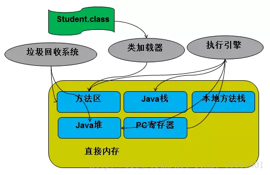

---

title: Java虚拟机内存
date: 2018-6-23
categories: 转载
tags:
	- java

---

在讨论JVM内存区域分析之前，先来看一下Java程序具体执行的过程：

>Java 程序的执行过程：
>
>Java 源代码文件（.Java文件）-> Java Compiler（Java编译器）->Java 字节码文件（.class文件）->类加载器（Class Loader）->Runtime Data Area（运行时数据）-> Execution Engine（执行引擎）。 

<!-- more -->

我们今天就来分析一下Java程序执行过程的 Runtime Data Area（运行时数据）这一块。

### 那么运行时数据区包括哪几部分呢？

- 程序计数器（Program Counter Register）
- Java虚拟机栈（VM Stack）
- 本地方法栈（Native Method Stack）
- 方法区（method area）
- 堆（heap）

## 一、程序计数器

　　用来指示程序执行哪一条指令，这跟汇编语言的程序计数器的功能在逻辑上是一样的。JVM规范中规定，如果线程执行的是非native方法，则程序计数器中保存的是当前需要执行的指令地址，如果线程执行的是native方法，则程序计数器中的值undefined。

　　每个线程都有自己独立的程序计数器。为什么呢？

　　因为多线程下，一个CPU内核只会执行一条线程中的指令，因此为了使每个线程在线程切换之后能够恢复到切换之前的程序执行的位置，所以每个线程都有自己独立的程序计数器。

## 二、Java虚拟机栈

　　Java虚拟机栈中存放的是一个个栈帧，当程序执行一个方法时，就会创建一个栈帧并压入栈中，当方法执行完毕之后，便会将栈帧移除栈。

　　我们所说的“栈”是指Java虚拟机栈，一个栈帧中包括：局部变量表、操作数栈、动态连接、方法返回地址、附加信息。

### 局部变量表

　　局部变量表主要是存储方法中的局部变量，包括方法中局部变量的信息和方法的参数。如：各种基本数据类型（boolean、byte、char、short、int、float、long、double）、对象引用（reference类型，它不等同于对象本身，可能是一个指向对象起始地址的引用指针，也可能是指向一个代表对象的句柄或其他与此对象相关的位置）和returnAddress类型（指向了一条字节码指令的地址），其中64位长度的long和double类型的数据会占用2个局部变量空间（Slot），其余的数据类型只占用1个。

　　局部变量表的大小在编译器就可以确定其大小了，因此在程序执行期间局部变量表的大小是不会改变的。

> 在Java虚拟机规范中，对这个区域规定了两种异常状况：
>
>- 如果线程请求的栈深度大于虚拟机所允许的深度，将抛出StackOverflowError异常；
>- 如果虚拟机栈可以动态扩展（当前大部分的Java虚拟机都可动态扩展，只不过Java虚拟机规范中也允许固定长度的虚拟机栈），如果扩展时无法申请到足够的内存，就会抛出OutOfMemoryError异常。

### 操作数栈

　　虚拟机把操作数栈作为它的工作区，程序中的所有计算过程都是在借助于操作数栈来完成的，大多数指令都要从这里弹出数据，执行运算，然后把结果压回操作数栈。

### 动态连接

　　每个栈帧都包含一个指向运行时常量池中该栈帧所属方法的引用（指向运行时常量池：在方法执行的过程中有可能需要用到类中的常量），持有这个引用是为了支持方法调用过程中的动态连接。

### 方法返回地址

　　当一个方法执行完毕之后，要返回之前调用它的地方，因此在栈帧中必须保存一个方法返回地址。

### 附加信息

　　虚拟机规范允许具体的虚拟机实现增加一些规范里没有描述的信息到栈帧中，例如与高度相关的信息，这部分信息完全取决于具体的虚拟机实现。在实际开发中，一般会把动态连接，方法返回地址与其它附加信息全部归为一类，称为栈帧信息。

## 三、本地方法栈

　　本地方法栈（Native Method Stack）与虚拟机栈所发挥的作用是非常相似的，它们之间的区别不过是虚拟机栈为虚拟机执行Java方法（也就是字节码）服务，而本地方法栈则为虚拟机使用到的Native方法服务。

> 与虚拟机栈一样，本地方法栈区域也会抛出StackOverflowError和OutOfMemoryError异常。

## 四、堆（heap）

　　在C语言中，程序员可以通过malloc函数和free函数在堆上申请和释放空间。那么在Java中是怎么样的呢？Java中的堆是用来存储对象本身的以及数组（当然，数组引用是存放在Java栈中的），几乎所有的对象实例都在这里分配内存。在Java中，程序员基本不用去关心空间释放的问题，Java的垃圾回收机制会自动进行处理。

　　另外，堆是被所有线程共享的，在JVM中只有一个堆。

## 五、方法区

　　方法区（Method Area）与Java堆一样，是各个线程共享的内存区域，它用于存储已被虚拟机加载的类信息、常量、静态变量、以及编译器编译后的代码等。

　　运行时常量池（Runtime Constant Pool）是方法区的一部分。Class文件中除了有类的版本、字段、方法、接口等描述信息外，还有一项信息是常量池（Constant Pool Table），用于存放编译期生成的各种字面量和符号引用，这部分内容将在类加载后进入方法区的运行时常量池中存放。

> 在JVM规范中，没有强制要求方法区必须实现垃圾回收。很多人习惯将方法区称为“永久代”，是因为HotSpot虚拟机以永久代来实现方法区，从而JVM的垃圾收集器可以像管理堆区一样管理这部分区域，从而不需要专门为这部分设计垃圾回收机制。不过自从JDK7之后，Hotspot虚拟机便将运行时常量池从永久代移除了。

原文地址：https://www.jianshu.com/p/4f32f371215d