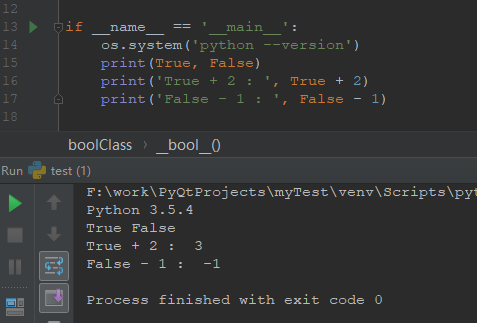
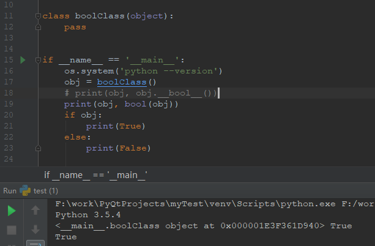
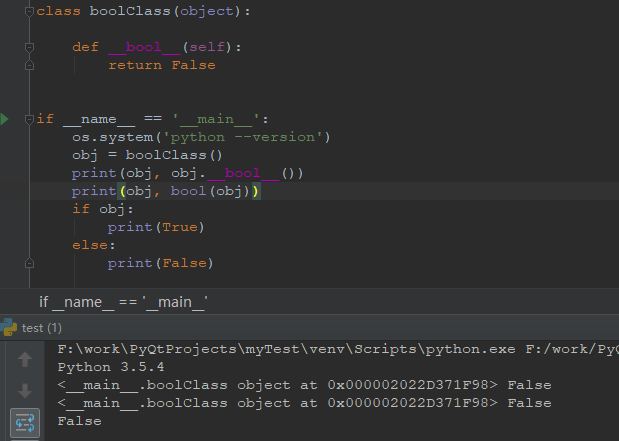
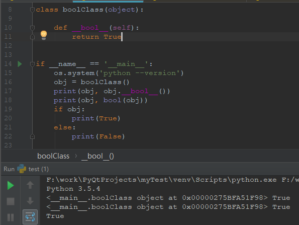
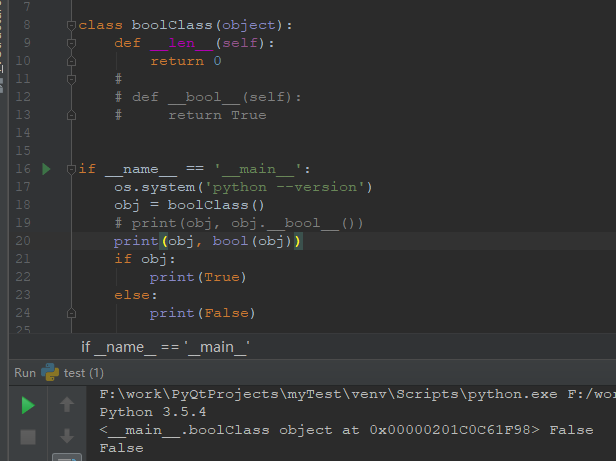
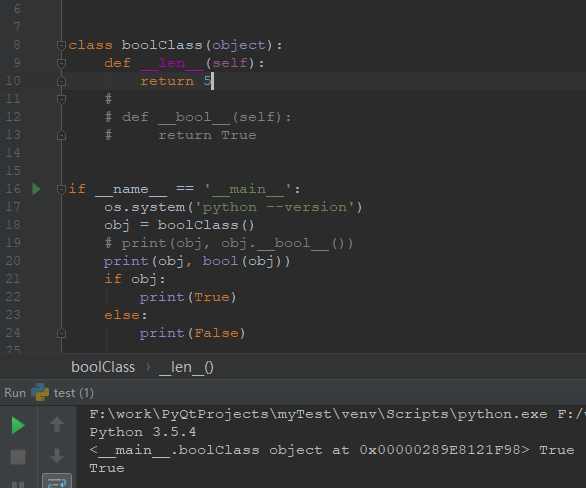
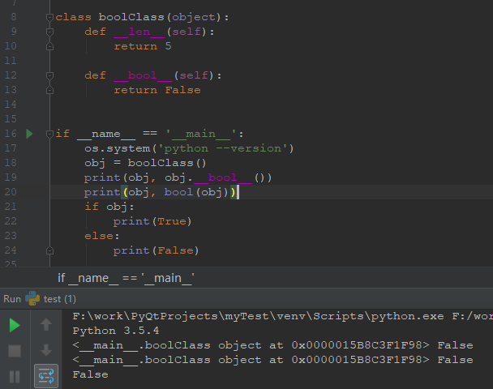

---

title: 'python对象的真与假'
date: 2018-6-21 
categories: python
description: Python最初是用int来做真假逻辑判断的。在Python 2.3版本开始引入bool类型（True与False）。bool类是int的子类，所以True和False也就相当于1和0。在python的条件判断语句中传入 False,0,'',(),[],{},None,set()时都为假，非None对象一般来说是真，但也可以是假。

---

## python中的真假值对照表

|类型	|False	|True|
| -------|:------------:|:-----------:|
|布尔	|False	|True|
|数值	|0,   0.0	|非零的数值|
|字符串	|''(空字符串)	|非空字符串|
|容器	|[],  (),  {},  set()	|至少有一个元素的容器对象|
|None	|None和某些非None对象	| 大部分非None对象 |

## 非None对象的真假值判断

### bool类介绍

Python最初是用int来做真假逻辑判断的。在Python 2.3版本中开始引入bool类型（True与False）。

bool类是int的子类，所以True和False也就相当于1和0。

下面看一下bool类：

	class bool(int):
	    """
	    bool(x) -> bool
	    
	    Returns True when the argument x is true, False otherwise.
	    The builtins True and False are the only two instances of the class bool.
	    The class bool is a subclass of the class int, and cannot be subclassed.
	    """

>注释翻译：当参数x为真时，返回为真，否则将返回False。真的和假的是类bool的两个实例。类bool是类int的子类，不能被子类化。

打印一下发现，确实是这样的！
 

### 对象真假值分析

在做真假逻辑判断时，我们通过if 来判断这个对象的真假时，其实是通过bool()来进行判断的，也就是if a： 相当于if bool(a): ，而if bool(a): 其实是通过对象的`__bool__()`（python2 中是`__nonzero__()`）函数或者`__len__()`的返回值来决定的，下面来看一下`__bool__()`和`__nonzero__()`函数的官方文档介绍：

- `object.__bool__(self)`

> Called to implement truth value testing and the built-in operation bool(); should return False or True. When this method is not defined, `__len__()` is called, if it is defined, and the object is considered true if its result is nonzero. If a class defines neither`__len__()` nor `__bool__()`, all its instances are considered true.

- `object.__nonzero__(self)`

> Called to implement truth value testing and the built-in operation bool(); should return False or True, or their integer equivalents 0 or 1. When this method is not defined, `__len__()`is called, if it is defined, and the object is considered true if its result is nonzero. If a class defines neither `__len__()` nor `__nonzero__()`, all its instances are considered true.

> 有道翻译：要求实现真值测试和内置的bool（）;应该返回False或True。当这个方法没有被定义时，如果它被定义了，len（）就会被调用，如果它的结果是非零的，那么这个对象就被认为是正确的。如果一个类既没有定义len（）也不定义bool（），那么它的所有实例都被认为是正确的。

写一个类重写`__bool__()`和`__len__()`试一下：

先看一下正常的：

重写`__bool__()`返回False:

 
重写`__bool__()`返回True:

 

重写`__len__()`返回0:

重写`__len__()`返回大于0:

重写`__len__()`返回大于0，`__bool__()`返回False:

## 结论
`__len__()`函数对非None对象的真假判断起辅助作用，`__bool__()`函数起决定作用。

最后再python官方文档对`object.__bool__`的介绍：

[https://docs.python.org/3.5/reference/datamodel.html?highlight=__bool__#object.__bool__](https://docs.python.org/3.5/reference/datamodel.html?highlight=__bool__#object.__bool__)

